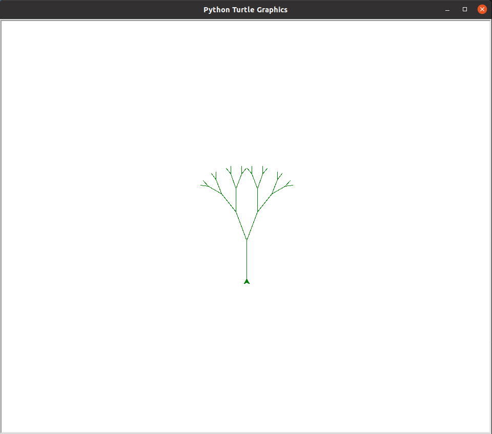
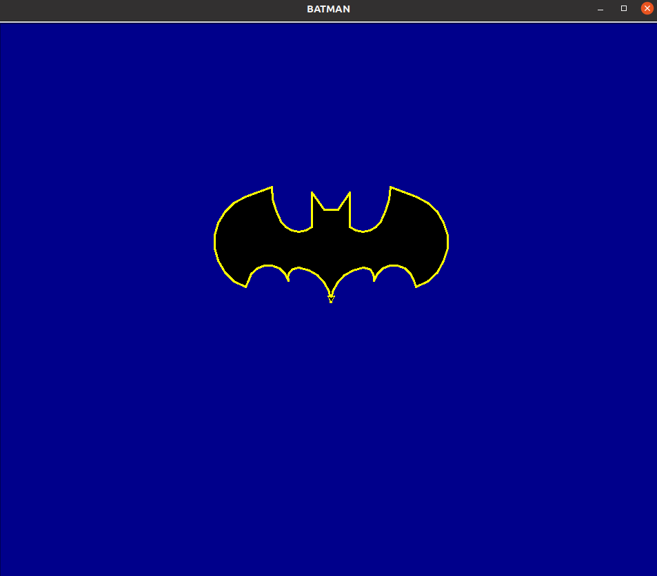

# Turtle Task

Using the tutorials here https://realpython.com/beginners-guide-python-turtle/ create any shape/logo/object you want in python and turtle. Upload the code and the picture of the output you get as the answer.

Output of example1 tree.py:

Output of example 2 batman.py:

